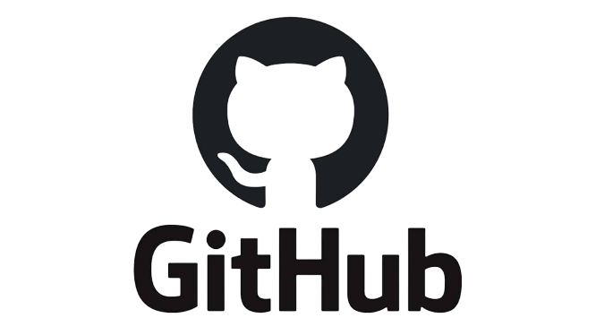

# Memoru

- Universidad de La Laguna
- **Asignatura:** Sistemas Inteligentes
- **Proyecto Final de Asignatura:** Bot de Discord

## Índice
- [Autores](#autores)
- [Descripción](#descripción)
- [Recursos utilizados](#recursos-utilizados)

## Autores
  - Cristo García González - alu0101204512@ull.edu.es
  - Eduardo Expósito Barrera - alu0101230382@ull.edu.es

## Descripción
  - Memoru es un proyecto que tiene como propósito ayudar a los usuarios a memorizar cualquier temática que desee, pudiendo de esta manera aprender de una manera más dinámica y rápida además de poder dedicarle más tiempo a otro tipo de actividades.

## Proyectos similares
- Con respecto a los proyectos similares, los más desarrollados hasta el momento y más funcionales podemos encontrar los siguientes:
    - **[Anki](https://apps.ankiweb.net/):** 
        - Anki es un software para memorizar utilizando tarjetas. Este software utiliza la técnica de la repetición espaciada, ya que se ha demostrado que aumenta la tasa de memorización.
         
        

          
        

  
    - **[SuperMemo](https://www.supermemo.com/es):**
        - SuperMemo es un método de aprendizaje apoyado por un software. Además, es también una aplicación práctica de la repetición espaciada que fue propuesta por varios psicólogos sobre 1930.
         
            

          
        

  
## Recursos utilizados
- Para la realización del proyecto los recursos que hemos utilizado han sido los siguientes:
    - **[Python](https://www.python.org/downloads/):** Lenguaje de programación que permite crear fácilmente prototipos o aplicaciones que no vayan a variar o escalar demasiado.
     
    

      
    
 
    
    - **[API para bots de Discord](https://support.discord.com/hc/es/articles/212889058-API-Oficial-de-Discord):** Debido a que nuestro sistema solo es eficiente si se usa con constancia, es por ello que hemos decidido integrarlo en una aplicación de uso cotidiano como Discord, con la finalidad de que sea cómoda de utilizar para el usuario.
     
    

      
    
 
    
    - **[MongoDB](https://www.mongodb.com/):** Es un sistema de base de datos NoSQL, orientado a documentos. Este sistema, guarda estructuras de datos BSON con un esquema dinámico, haciendo que la integración de los datos en ciertas aplicaciones sea más fácil y rápida.
     
    

      
    

    
    - **[Heroku](https://www.heroku.com/):** Debido a la facilidad de uso y un buen sistema gratuito Heroku es el sistema donde vamos a “hostear” el bot.
     
    

      
    
 
    
    - **[Github](https://github.com/):** Software utilizado para mantener un control de versiones del código desarrollado.
     
    

      
    

    - **[Google Drive](https://www.google.com/intl/es_es/drive/):** Es un servicio de alojamiento de archivos el cual hemos utilizado para la realización de informes y de la presentación.
     
    

      
    
